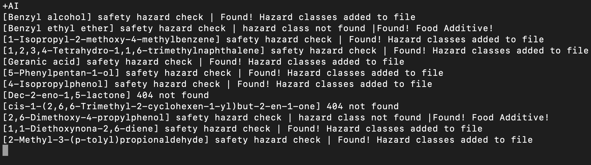
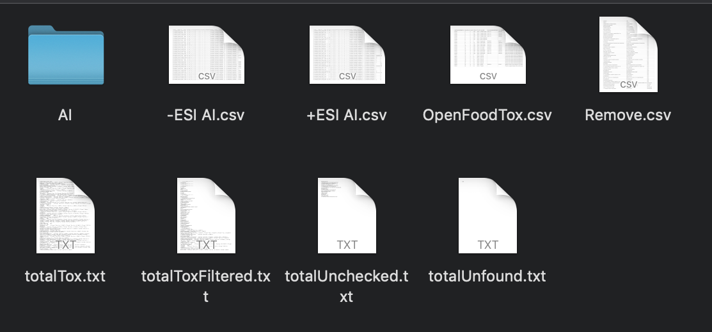
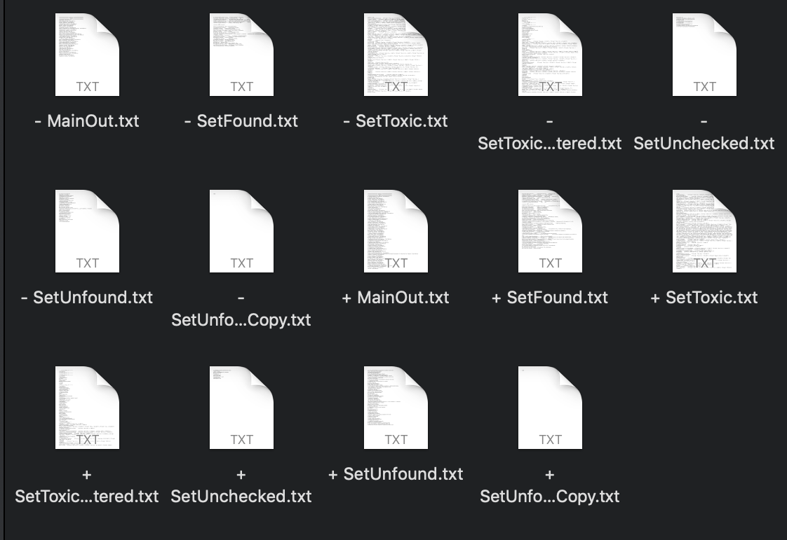
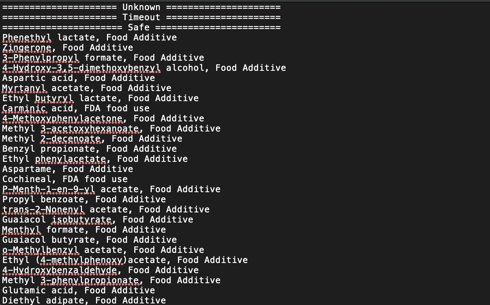
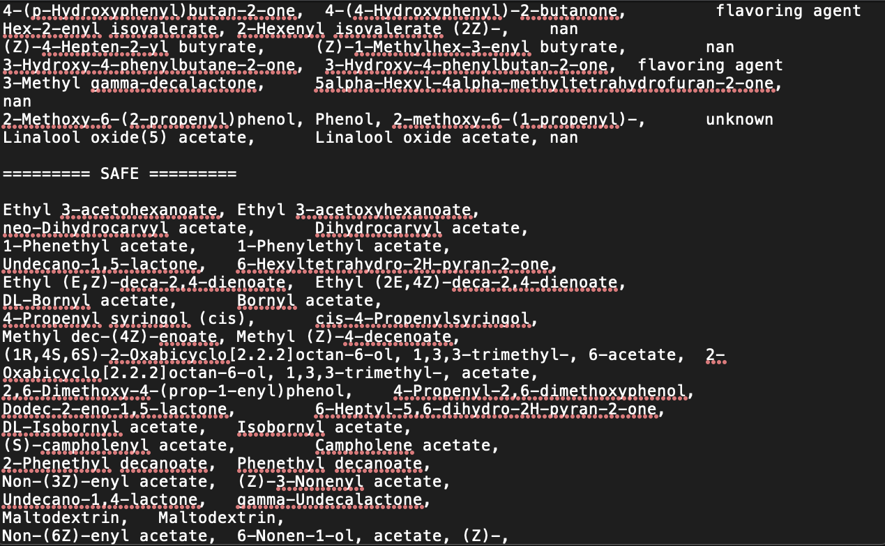
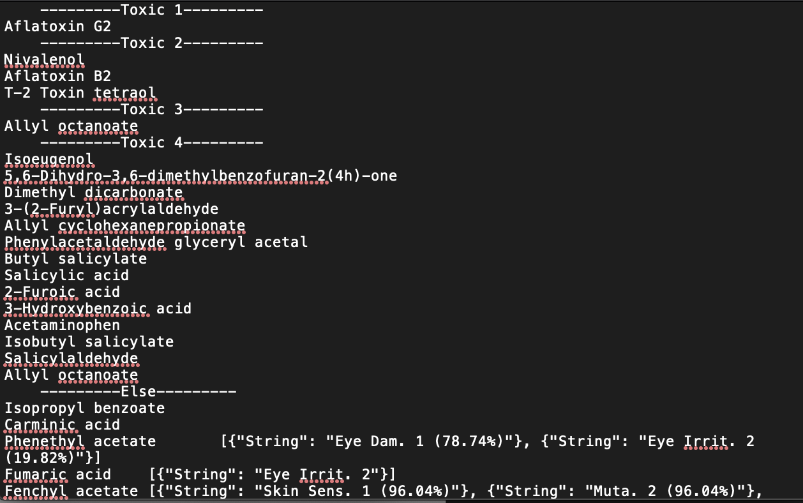

# ToxAssign

`ToxAssign` is designed to take the output of [MFAssignR](https://github.com/skschum/MFAssignR) and process the toxic compounds into an easily readable and understandable format.

Contents
========

 * [Why?](#why)
 * [Installation](#installation)
 * [Usage](#usage)
 * [Output](#output)
 
 ### Why?
 
&nbsp;&nbsp;&nbsp;This project has been designed in tandem with MOST's [BioPROTEIN project](https://www.appropedia.org/BioPROTEIN) to act as a precursor to live animal testing of completely novel food sources. This is intended to decrease the number of live animal tests required as to both decrease cost and increase ethical use of research resources. This project also seeks to serve as a useful tool in researching potential food sources for desperate times such as common agricultural wastes and potential future reprocessing research. To mee this goal this project uses entirely open source and free to use tools in its full workflow, including [MZMine](http://mzmine.github.io) and the previously mentioned [MFAssignR](https://github.com/skschum/MFAssignR).
 
 
 ### Installation
 The installation of this project is very simple. 
 1. Install with [`pip3`](https://pypi.org/project/shallow-backup/)
    + `$ pip3 install shallow-backup`
    + `$ shallow-backup`

### Usage
&nbsp;&nbsp;&nbsp;To operate this tool, the user will need to place the csv files containing formulas they want to process in an empty folder along with the open food tox csv and the remove csv as in figure 29. The OpenFoodTox file contains the database of toxic compounds with their related formulas and the Remove file contains compounds that are not found on the PubChem database and thus are classified by hand.

The formulas must match in format and must have a header above them labeled “formula” to be properly recognized. The files must also have the format of "(sign) (compound).csv" to be properly recognized. Then, the user will open a terminal window inside of the folder with the data to be processed and run the command toxassign. This will begin to output to the terminal with an output that looks similar to the following figure, starting with the name of the first compound to be processed followed by a print out of all the matched compounds and their assignment.

Finally, there may be records that are not recognized by PubChem's database or are under a different name. To manage these a local database has been collated to deal with and categorize these compounds. When you classify unfound records, ensure to add them to the `Remove.csv` file for later use in the format already demonstrated in the file. The safety column falls into two broad categories: `safe`, determined by the keywords `safe`, `flavoring agent`, `fragrance`, or `supplement`; and as `other` determined by any other keywords.
### Output
Once the code has terminated the directory will contain 4 new files and one directory per compound. The 4 new files, totalTox, totalToxFiltered, totalUnchecked, and totalUnfound, will contain all of the toxic records, all of the toxic records sorted by toxicity, all of the records not sorted, and all of the records not found in the PubChem database. 

The folders created by ToxAssign are each named after a compound delivered in the input. Each folder contains "+/- MainOut”, “+/- SetFound”, “+/- SetToxicFiltered”, “+/- SetUnchecked”, and “+/- SetUnfoundCopy”.

MainOut contains the compounds that either had a large unknown error, those that timed out when accessing the PubChem server, or those that were deemed safe by being food additives. 

SetFound contains compounds that were not found on PubChem but were identified in the list of compounds found by hand, sorted by unsafe and safe. 

SetUnchecked contains compounds that were found on PubChem but did not have enough information and SetUnfound contains compounds that were not found on PubChem or in the list of compounds found by hand. Finally SetToxic contains all the compounds that contain either safety classes or toxic records, at the top by acute toxicity and at the bottom containing their safety classes or no data for toxic records. 

